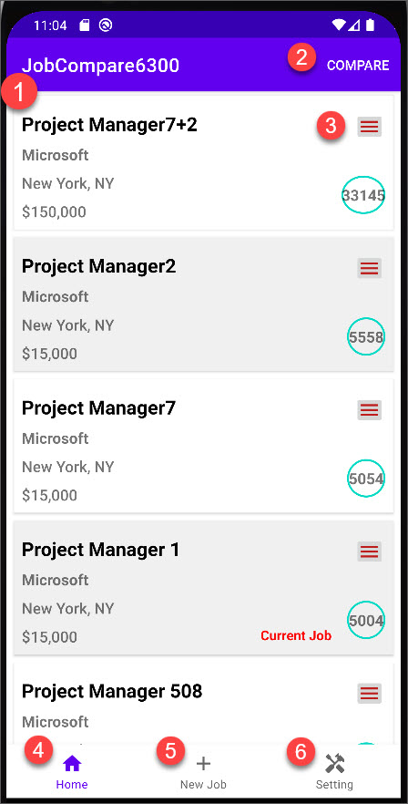
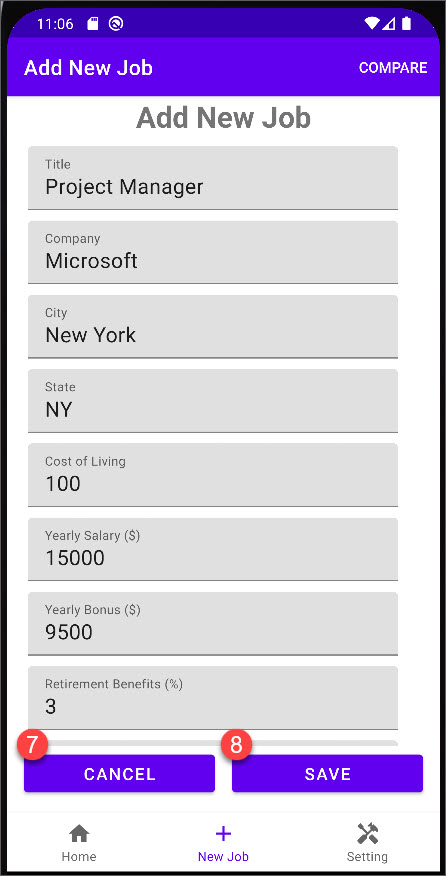
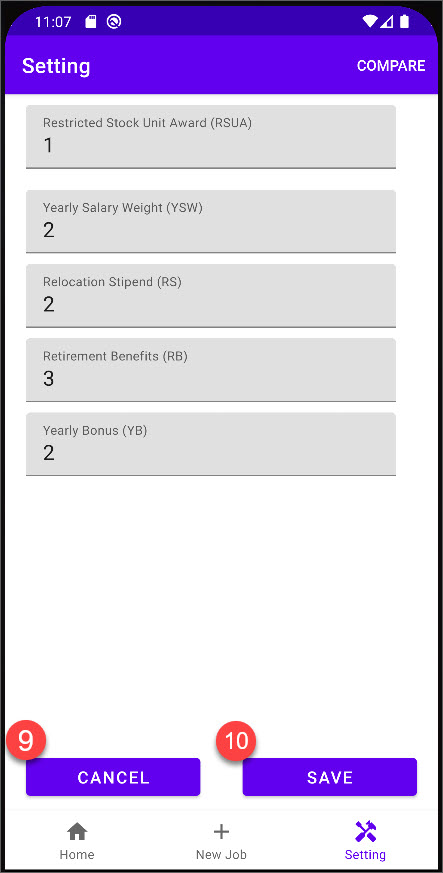
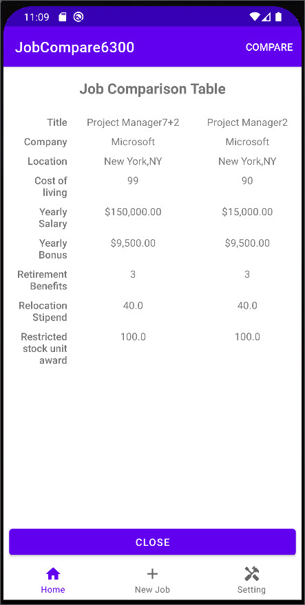

# User Manual
## App: Job Comparior

## Overview
    > Job Comparior App allows user to save multiple job with its details and compare them based on cost of living, salary, bonus, benefits, and more
    > Job data is stored in local device SQLite database

## Instruction

1. The **JobCompare6300** is an intuitive application allowing for the comparison of a user's **current job** with **potential jobs** based on various factors including **location, cost of living, yearly salary, retirement benefits amongst others**.
When the application is successfully opened and running, users will be prompted with Application Landing Page.

1) Job Card - This displays a brief summary of Job
2) Begin "Compare" process of two jobs
3) Menu Button of the job card that allows user to Delete, Edit or set to current Job
4) Move to Home screen
5) Add New JOb
6) Change Setting Screen

2. Select **New Job (5)** to add a new job.

    > When done click (8) Save Button OR (7) Cancel to go back to Home without saving

3. Setting
    > This is where user can change weights of each information for comparison and scoring purpose

4. Comparison
    > If you want to compare two jobs. click "Compare"(2) on top of the screen. Then select two jobs to compare.
    > Once two jobs are selected, click "Done" to see the Job comparison table
    

## Known Bug(s)
There is known bug that we weren't able to handle due to time constraint
After the first comparison of two jobs, if user clicks "Compare" button again on top of the "Comparison Table" screen, it doesn't go back to Home nor change "menu" icon to "Check-box" icon
Here's how to re-produce the bug
1. Go Home
2. Click "Compare" button on top, then select two jobs
3. Click "Done"
(from here)
4. Click "Compare" button on top of the screen

At this point, you will see the manu changes the label, but doesn't go back to "Home" screen
